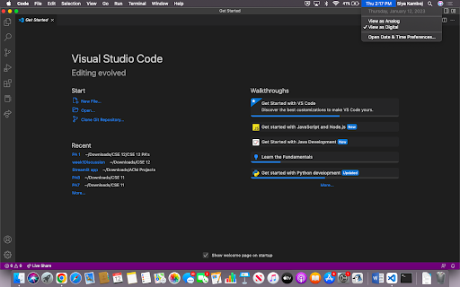
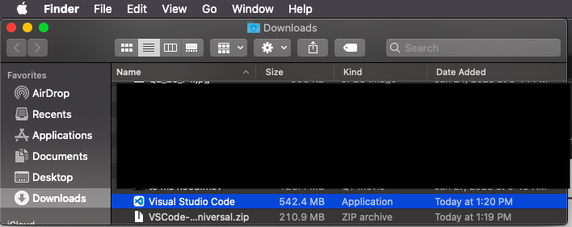
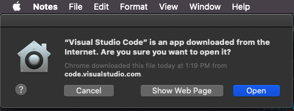
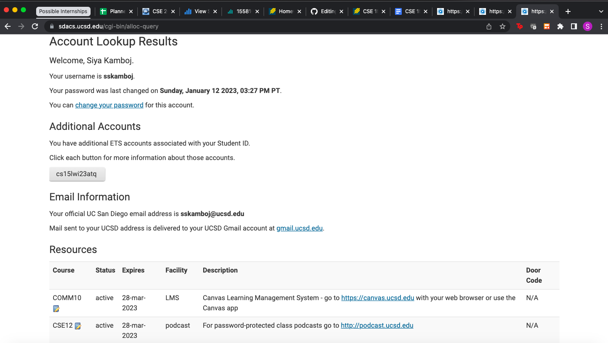
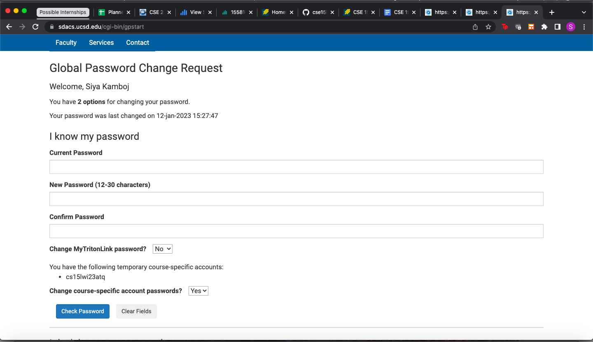
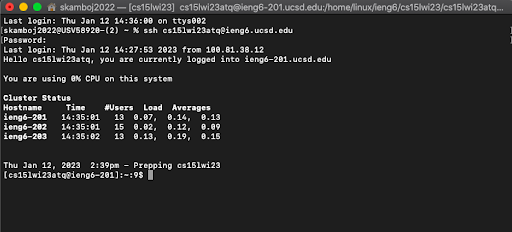
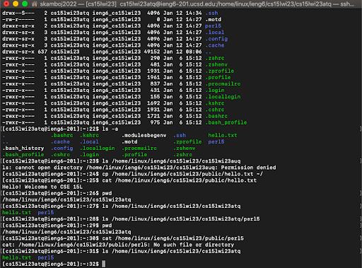

# Lab Report 1

## Installing VSCode on my personal device

  Since VSCode was my IDE for CSE 11, I had already downloaded it on my macbook last quarter. However, for the purposes of this lab, I reinstalled it on my local device by following the instructions on [this website]( https://code.visualstudio.com/docs/setup/mac ). As per the first step, I clicked [this link]( https://go.microsoft.com/fwlink/?LinkID=534106 ) which automatically downloaded a zip file to my laptop's downloads folder. To open the zip file, I double clicked it, which, subsequently, installed the Visual Studio Code application in my Downloads folder, as shown below: 
  

   Then, I dragged the Visual Studio Code Application to the Applications folder; however, since I already had Visual Studio Code in my applications folder, I was prompted to choose whether I want to keep both apps, replace the current VSCode app, or stop the operation, and I chose to replace the current VSCode application. To confirm that the newly installed VSCode worked, I double clicked the app in the applications folder, and the following message popped up: 

   After selecting "yes", I was successfully able to open and run new and existing projects in VSCode. For all future projects, I was able to open VSCode without the pop-up message. 

## Remotely Connecting to the computers in the CSE Building

  To remotely connect to the UCSD ieng6 server, I first found my course specific account for CSE15L at [this link]( https://sdacs.ucsd.edu/~icc/index.php ), which redirected me to a page where I inputted my UCSD username (sskamboj) and PID. After submitting my username and PID, the website led me to the first page pictured below, informing me that my account username is cs15lwi23atq. When I selected the button with my username, I was redirected to an information page which had an option to change my password using the Global Password Reset tool. For the "current password" field, I inputted the default password that was emailed to me, and inserted my own password for the new password.

*This is the first screenshot, where I found my course specific account.*

*This is the second screenshot, where I was able to change my password for my CSE 15L Account. It should be noted that this screenshot is from the second time I reset my password, as I forgot to screenshot my first password reset during lab.*
  
  After about 15 minutes, my password was successfully updated, so I tried to follow the [instructions]( https://ucsd-cse15l-w23.github.io/week/week1/#week-1-lab-report ) given in class. However, the rest of my lab group and I had issues setting our default terminals to use gitbash in VSCode. After about 5 minutes of difficulty, one of my group members (who also used a macbook) discovered that we could simply use the terminal on our macs instead of configuring the terminal in VSCode, since we are not using Windows. 
  
  After we solved the issue with the terminal, I was able to establish a connection with the UCSD ieng6 servers by typing `ssh cs15lwi23atq@ieng6.ucsd.edu`. When I first connected, I had to confirm that I received the following message on the terminal:
  
  `The authenticity of host 'ieng6.ucsd.edu (128.54.70.227)' can't be established.
  
   RSA key fingerprint is SHA256:ksruYwhnYH+sySHnHAtLUHngrPEyZTDl/1x99wUQcec.
   
   Are you sure you want to continue connecting (yes/no/[fingerprint])? `
  
  Since I wantted to continue connecting, I typed `yes` and was prompted to input my password; however, after that, I consistently received the message pictured below every time I connected, which did not prompt me to proceed with any further action, aside from typing in my password. 
  

## Experimenting with Commands on the Terminal

Once I established a secure connection to the ieng6 server using the aforementioned steps, I ran through a series of commands to experiment with the connection, as shown in the photo above. 
1. The first command in this screenshot is `ls -a`
* From prior class knowledge, I knew that `ls` listed all the files in the current directory, and it seems as though `ls -a` lists addition files in the current directory, where the first character is a period. Upon further online research, it seems as though files, in which periods prepend the name, denote hidden files, and `ls -a` also lists out these hidden files. 

2. The next command is `ls /home/linux/ieng6/cs15lwi23/cs15lwi23auq`
* When trying to access another group member’s files (using the `ls /home/linux/ieng6/cs15lwi23/cs15lwi23auq` command), I got the message “Permission denied,” likely to ensure that you cannot search through other students’ files without being logged in to their account. On the other hand, when I insert my own account (rather than a group members) later on, it returns 2 things: hello.txt and perl5, showing that I have the permissions to access my own files through the remote server.

3. `cp /home/linux/ieng6/cs15lwi23/public/hello.txt ~/`
* cp commands copy files to another directory, and typically follow this format: `cp     current directory      directory where file will get coped`. Hence, I believe that this command copies the hello.txt file located in the /home/linux/ieng6/cs15lwi23/public directory to the home directory, "~/". 

4. `cat /home/linux/ieng6/cs15lwi23/public/hello.txt`
* This command prints the contents of hello.txt in the terminal, which is "Hello! Welcome to CSE 15L", as shown above in the picture.

5. `ls /home/linux/ieng6/cs15lwi23/cs15lwi23atq`
* This command lists all the non-hidden files in the "/home/linux/ieng6/cs15lwi23/cs15lwi23atq" directory, which is my own account's directory. As shown above, the only 2 non-hidden files are perl5 and hello.txt. 

6. In the next couple commands, I unsuccessfully attempted to find out what perl5 was. First, I assumed it was a directory and tried to list all the files inside of it using ` ls /home/linux/ieng6/cs15lwi23/cs15lwi23atq/perl5`. When that yielded no output, I first ensured I was in the appropriate directory, using `pwd`. Then, I assumed 
that perl5 was a file, like hello.txt and tried to use the `cat` command, which resulted in an error message of "No such file or directory." Due to time contraints, I did not further explore what perl5 was. 
