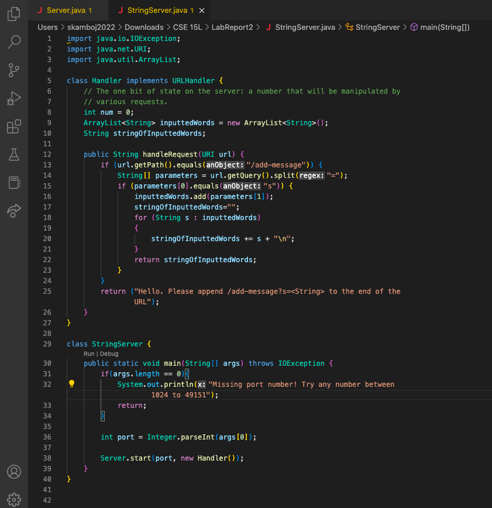
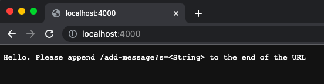
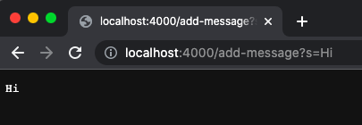
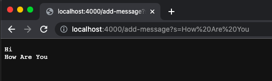
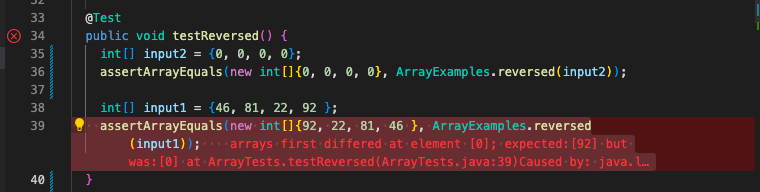

# Lab Report 2

## Writing a Web Server

We were tasked with making a web server that tracks incoming parameters and prints them out for the user to see. In this server, the user would send their requests by appending `/add-message?s=<string> ` to the end of the http://localhost:# url. A screenshot of the code is pasted below; additionally, the entire code can be found at [this link](https://github.com/SiyaKamboj/cse15l-lab-reports/tree/main/LabReport2).



To start the server, first compile the 2 java classes by typing `javac Server.java StringServer.java`; then, type `java StringServer 4000` to run the String Server class. As seen in the screenshot above, this runs `public static void main(String[] args)` method in the String Server class and accepts a number parameter, which will be the port where the server is hosted. In this example, because I inputted 4000 as a parameter, the server now runs on http://localhost:4000 . 

When you go to http://localhost:4000 , the Handler method will be called, and the `inputtedWords` & `stringOfInputtedWords` variables will be declared. Then, the `public String handleRequest(URI url)` method will be called, with the current URL ( http://localhost:4000 ) as the parameter. Then, the `getPath` command checks if the path for current URL/parameter equals `/add-message`; however, since the path is currently `/`, the block in the if-statement (which includes `getQuery` and parameter analysis) is not executed, so "Hello. Please append /add-message?s=<String> to the end of the URL" is returned. This is demonstrated in the screenshot below. 
  

  
If you go to http://localhost:4000/add-message?s=Hi, the Handler method will again be called, and the `inputtedWords` & `stringOfInputtedWords` variables will be re-declared. Then, the `public String handleRequest(URI url)` method will be called again, with the current URL ( http://localhost:4000/add-message?s=Hi ) as the parameter. Then, the method checks if the path for current URL/parameter equals `/add-message`; since it does, the code then splits the query at the equals sign. In this case, because the character before the equals sign is 0, it is saved into `params[0]`, and "Hi" is saved into `params[1]` since it immediately follows the `s=`. Because the first parameter is "s", the "Hi" is appened to the end of the empty ArrayList `inputtedWords`. Then, the content(s) from `inputtedWords` are concatenated into the `stringOfInputtedWords` String, which separates each indivual element with a new line. Ultimately, this string, which contains all the inputtedWords (in this case, only "Hi" has been inputted), is returned and displayed on the webpage, as shown below.
  

  
Afterwards, if you then go to  http://localhost:4000/add-message?s=How Are You , the process mentioned above repeats, except `params[1]` contains "How Are You" instead of "Hi". Hence, "How Are You" is appended to the end of `inputtedWords` ArrayList, which already contained "Hi". Hence, the following is outputted: 
  

  
---
  
## The Bug In the "reversed" Method
> Failure-inducing input for the buggy program, as a JUnit test and any associated code
  
  ```
  @Test
  public void testReversed() {
    int[] input1 = {46, 81, 22, 92 };
    assertArrayEquals(new int[]{92, 22, 81, 46 }, ArrayExamples.reversed(input1));
  }
  ```
  
> An input that doesn’t induce a failure, as a JUnit test and any associated code 

```
  @Test
  public void testReversed() {
    int[] input2 = {0, 0, 0};
    assertArrayEquals(new int[]{0, 0, 0}, ArrayExamples.reversed(input2));
  }
```
  
> The symptom, as the output of running the tests (provide it as a screenshot of running JUnit with at least the two inputs above)
  
  
  
In the original code, a new integer array is declared but never initialized; hence, it is automatically filled with the null value: 0. Therefore, while traversing the array and copying the contents in reverse to the existing array, only the value 0 is consistently copied over. Because the first array is made up of 0's, its reverse will also be all 0's, thereby making it correct. On the other hand, the second array's reverse should be 92, 22, 81, 46, but only 0's are printed out. 
  
> The bug, as the before-and-after code change required to fix it (as two code blocks in Markdown)
  
  The original code: 
  
  ```
  static int[] reversed(int[] arr) {
    int[] newArray = new int[arr.length];
    for(int i = 0; i < arr.length; i += 1) {                             
      arr[i] = newArray[arr.length - i - 1];                           
    }                              
    return arr;                              
  }
 ```
 
The fixed code:
```
static int[] reversedNew(int[] arr) {
    int[] newArray = new int[arr.length];
    for (int i=0; i<arr.length; i++){
      newArray[i]= arr[i];
    }
    for(int i = 0; i < arr.length; i += 1) {
      arr[i] = newArray[arr.length - i - 1];
    }
    return arr;
}
```
In the original code, the length of the array is initialized, but the contents are never copied over, so when information is pulled from the new array, you are pulling only the null value: 0. In the new code, the new array deep copies the contents of the original array, so actual values are getting pulled.

---
## Reflection
  
In week 2, we learned how to clone a git repository, make changes on the local device, and then push the changes back to github. This is helpful for me, since changes made on a local device are instantly reflected on the local webpage; whereas, changes made directly on github are cached and take a couple minutes to reflect on the actual website. Additionally, learning how to properly clone a git repository helps avoid merge conflicts in the future. 

