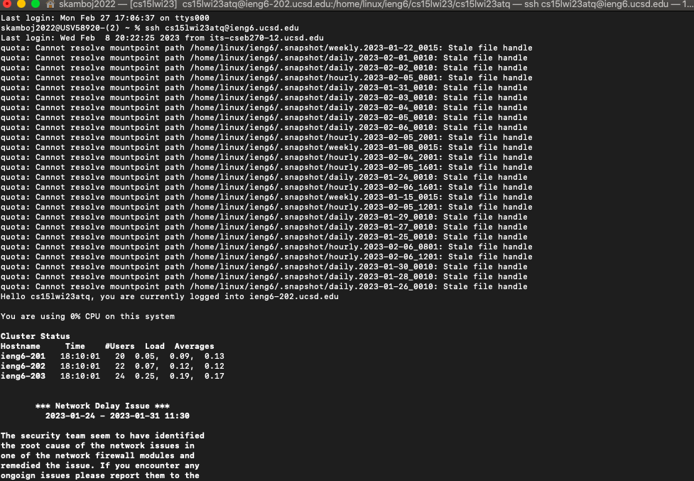

# Lab Report 4 - Quickly Navigating the Command Line

This lab report is written under the assumption that you have generated an ssh key for your ieng6 account, so that you do not have to type your password for every login attempt. It is also assumed that you have generated an ssh key for your github account, so that you can git clone and git push when you are logged into your ieng6 account on the commandline. If none of these assumptions are true, [this link](https://ucsd-cse15l-w23.github.io/week/week7/) provides instructions for setting up both ssh keys.

1. Log into ieng6

  I typed `ssh cs15lwi23atq@ieng6.ucsd.edu` into my terminal. Since I had the ssh key for the account, I was not prompted to enter a password; rather, I was automatically connected to the ieng6 server as shown below. 
  
  
3. Clone your fork of the repository from your Github account
4. Run the tests, demonstrating that they fail
5. Edit the code file to fix the failing test
6. Run the tests, demonstrating that they now succeed
7. Commit and push the resulting change to your Github account
