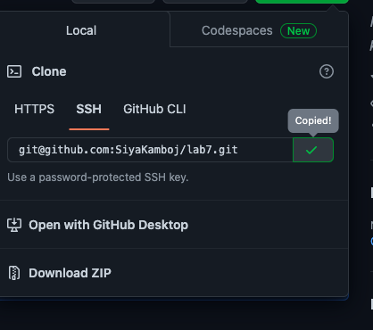
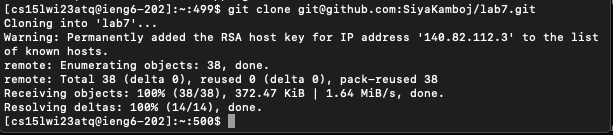
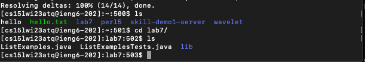
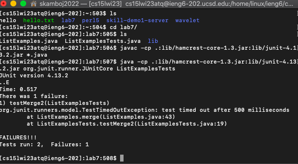
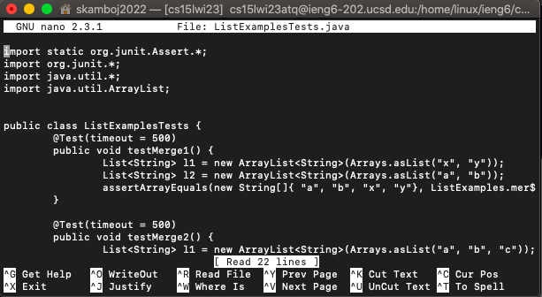

# Lab Report 4 - Quickly Navigating the Command Line

This lab report is written under the assumption that you have generated an ssh key for your ieng6 account, so that you do not have to type your password for every login attempt. It is also assumed that you have generated an ssh key for your github account, so that you can git clone and git push when you are logged into your ieng6 account on the commandline. If none of these assumptions are true, [this link](https://ucsd-cse15l-w23.github.io/week/week7/) provides instructions for setting up both ssh keys.

## Step 1 - Log into ieng6

  I typed `ssh cs15lwi23atq@ieng6.ucsd.edu` into my terminal. Since I had the ssh key for the account, I was not prompted to enter a password; rather, I was automatically connected to the ieng6 server as shown below. 
  
  
  
## Step 2 - Clone the repository

  Next, I copy pasted the ssh clone url from my forked copy of the lab repository, using the button next to the url (as shown below). 
 
 
  
  Then, I navigated back to my terminal, typed `git clone`, and pasted the ssh clone url to the terminal using `Command-V`. This cloned a copy of the lab 7 repository into my root directory in the ieng6 server. 
 
 
  
  It should be noted that for this step, the https url could have also been pasted after `git clone` to clone the repository on the ieng6 server; however, using the ssh clone url establishes a more secure connection with the repository, thereby allowing the `git push` to occur in an easier way in step 9. 
 
## Step 3 - Run the tests

   Next, I typed `ls` into the terminal to ensure that the repository was succesfully cloned to the current directory. Then, in order to change the current directory to lab7, I typed `cd l <tab>`, which autocompleted the search to `cd lab7/`, as shown in the image below. Afterwards, I pressed enter to change the current directory, and pressed `<up arrow> <up arrow> <enter>` to re-run `ls` in order to ensure that the directory was succesfully changed. 

  Now, to run the testers, I typed `<Ctrl-r>` into the terminal, which allowed me to search my terminal command history. I then typed `javac` which autocompleted the search to `javac -cp .:lib/hamcrest-core-1.3.jar:lib/junit-4.13.2.jar *.java`, according to my history. I, then, pressed `<enter>`, `<Ctrl-r>`, and typed `java <space>`, which autocompleted to `java -cp .:lib/hamcrest-core-1.3.jar:lib/junit-4.13.2.jar org.junit.runner.JUnitCore ListExamplesTests` because I had previously typed that to run my ListExamplesTest while practicing.
  
  

## Step 4 - Edit the code file
   First, I opened the "FileExampelesTests.java" file by typing `nano L <tab>`, which autocompleted to `nano ListExamples`. This prompted me to complete the line with `nano ListExamplesT <tab>`, which autocompleted to `nano ListExamplesTests.`. Then, I typed `j <tab`, which autocompleted the search to `nano ListExamplesTests.java`. After pressing `<enter>`, the nano screen took over my terminal, as shown below. 
   
   
   
   Then, I pressed `<Ctrl>-w` and typed `.merge` into the search bar to jump to the error faster. Then, using the left and right error keys, I switched "l1" and "l2" to fix the error.

8. Run the tests, demonstrating that they now succeed
9. Commit and push the resulting change to your Github account
